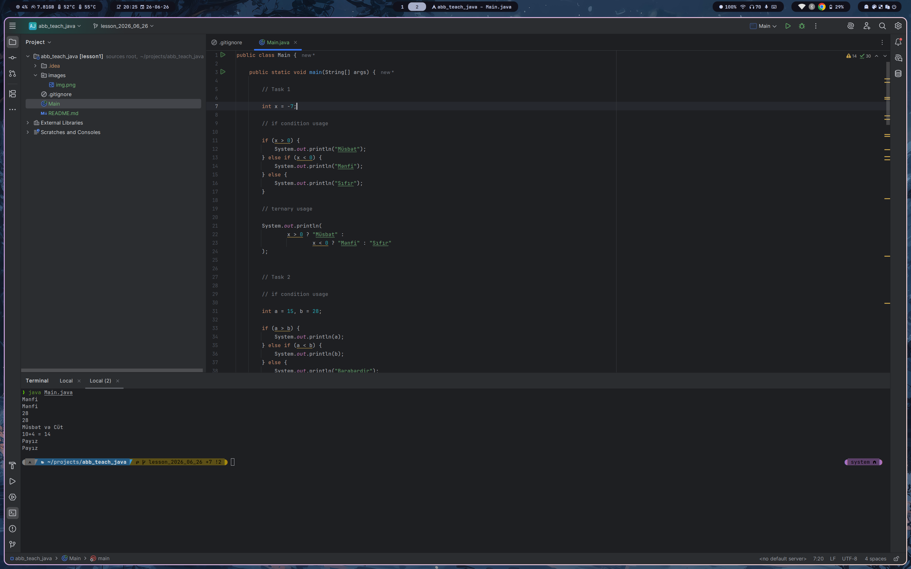

# Tasks

> **Qeyd:** Tasklar üçün yazılmış bütün kod `Main.java` faylının içindədir.

## Task Descriptions

1. `int x = -7;` — Proqram ekranda **"Mənfi"**, **"Müsbət"** və ya **"Sıfır"** yazsın. *(if-else)*
2. `int a = 15, b = 28;` — Bu iki ədəddən böyüyünü ekrana çıxarın. Bərabər olduqda **"Bərabərdir"** yazsın. *(if-else)*
3. `int n = 12;` — Ədədin həm cüt/tək, həm də müsbət/mənfi olduğunu göstərin. *(Nested if-else)*
4. `int x = 10, y = 4; char op = '+';` — `op` dəyişəninə görə toplama, çıxma, vurma və bölmə əməliyyatı aparın. Sıfıra bölmə halında xəbərdarlıq göstərin. *(switch-case)*
5. `int ay = 11;` — Ay nömrəsinə görə fəsli (**Yaz**, **Yay**, **Payız**, **Qış**) ekrana çıxarın. Birdən çox `case` eyni nəticəyə aparmalıdır. *(switch-case)*

## Console Output

