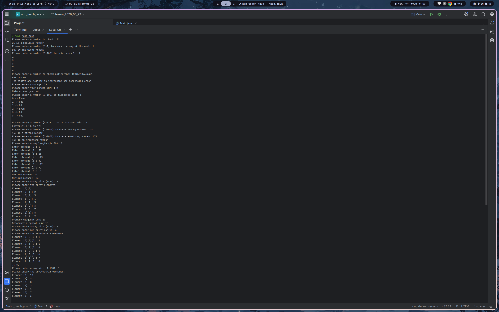

# Lesson Tasks

Bütün həllər tək faylda — [`Main.java`](./Main.java) — yerləşir.

## How to run

```bash
java Main.java
```

## Console output

Proqramın işləyən nümunəsi (bütün tapşırıqların ardıcıl icrası):



---

## Tasks

| # | Task | # | Task |
|---|------|---|------|
| [1](#task-1) | Positive / Negative / Zero | [8](#task-8) | Strong number |
| [2](#task-2) | Day of the week | [9](#task-9) | Armstrong number |
| [3](#task-3) | Odd numbers | [10](#task-10) | Ən böyük və ən kiçik ədəd |
| [4](#task-4) | Palindrome & digit order | [11](#task-11) | Diaqonalların cəmi |
| [5](#task-5) | Age & gender access | [12](#task-12) | 3D array şərti |
| [6](#task-6) | Fibonacci (even / odd) | [13](#task-13) | Sort & reverse |
| [7](#task-7) | Factorial | | |

---

### Task 1

Ask the user to enter a number. Determine if the number is **positive**,
**negative**, or **zero**, and print the result.

### Task 2

Ask the user to enter a number between **1 and 7**. Print the corresponding day
of the week for that number.

For example:

- `1` – Monday
- `2` – Tuesday
- ... and so on.

### Task 3

Ask the user to enter a number. Using a **loop**, print all the **odd numbers**
up to that number.

### Task 4

Ask the user to enter a number. Perform the following checks:

- If the number is a **palindrome** (e.g., `12321`), display that.
- If the digits of the number are in **increasing order** (e.g., `123489`), indicate that.
- If the digits of the number are in **decreasing order** (e.g., `97530`), indicate that.
- Otherwise, display: `"The digits are neither in increasing nor decreasing order."`

### Task 5

Ask the user to enter their **age** and **gender** (`M` or `F`).

- If the user is **under 18**, print `"Access denied"`.
- If the user is **18 or older**, print:
  - For `M`: `"Male access granted"`
  - For `F`: `"Female access granted"`
- If the user enters an incorrect gender, print `"Invalid gender entered"`.

### Task 6

Write a program that prints **Fibonacci numbers**.

- Ask the user how many Fibonacci numbers to print.
- If the entered number is zero or negative, print `"Please enter a valid number"`.
- Use **loops** to print the Fibonacci sequence.
- Show whether each Fibonacci number is **even** or **odd**.

### Task 7

Ask the user to enter a number and calculate its **factorial**.

- If the user enters a negative number, print `"Factorial does not exist for negative numbers"`.
- Use **loops** (like `i++` or `--`) during the calculation.
- Print the result.

### Task 8

A **"Strong number"** is defined as follows:

If the sum of the **factorials of each digit** of the number equals the number
itself, then it is a Strong number.

```
145 → 1! + 4! + 5! = 1 + 24 + 120 = 145  → ✅
123 → 1! + 2! + 3! = 1 +  2 +   6 =   9  ≠ 123 → ❌
```

- Calculate the factorial for each digit.
- Sum them up and compare the result with the original number.

### Task 9

An **Armstrong number** is defined as:

If the sum of each digit **raised to the power of the number of digits** equals
the number itself, then it is an Armstrong number.

```
153  → 1³ + 5³ + 3³        = 1 + 125 + 27         = 153  → ✅
9474 → 9⁴ + 4⁴ + 7⁴ + 4⁴   = 6561 + 256 + 2401 + 256 = 9474 → ✅
123  → 1³ + 2³ + 3³        = 1 + 8 + 27           = 36   ≠ 123 → ❌
```

- Extract the digits of the number.
- Count how many digits it has.
- Raise each digit to the power of the number of digits.
- Sum the results and compare with the original number.

### Task 10 — Ən böyük və ən kiçik ədədi tap

**Şərt:**

Verilmiş `int[]` tipli array-dən istifadə edərək:

- Ən böyük ədədi tap.
- Ən kiçik ədədi tap.
- Hər ikisini ekrana çap et.

**Nümunə:**

```java
int[] numbers = {4, 7, -2, 15, 0, 99, -100};
```

**Gözlənilən çıxış:**

```
Ən böyük ədəd: 99
Ən kiçik ədəd: -100
```

### Task 11 — 2 ölçülü array-də əsas və köməkçi diaqonalın cəmi

**Şərt:**

`3x3` ölçülü kvadrat matris verilir.

- Əsas diaqonal: `matrix[0][0]`, `matrix[1][1]`, `matrix[2][2]`
- Köməkçi diaqonal: `matrix[0][2]`, `matrix[1][1]`, `matrix[2][0]`

Hər iki diaqonalın cəmini hesabla və çap et.

> Hesablayan zaman sadəcə `matrix[0][0] + matrix[1][1] + matrix[2][2]` etməyin,
> **dövrlərdən** istifadə edin.

**Nümunə:**

```java
int[][] matrix = {
    {1, 2, 3},
    {4, 5, 6},
    {7, 8, 9}
};
```

**Gözlənilən çıxış:**

```
Əsas diaqonal cəmi: 15
Köməkçi diaqonal cəmi: 15
```

### Task 12 — 3 ölçülü array-də müəyyən şərtə uyğun ədədləri çap et

**Şərt:**

`3D` array verilir. `6`-dan böyük olan bütün ədədləri tap və çap et.

**Nümunə:**

```java
int[][][] cube = {
    {
        {1, 2}, {3, 4}
    },
    {
        {5, 6}, {7, 8}
    }
};
```

**Gözlənilən çıxış:**

```
6-dan böyük ədədlər: 7, 8
```

### Task 13 — Array-i sort edib tərsinə çap et

**Şərt:**

Verilən `int[]` array-i artan sıraya görə sort et. Daha sonra array-in tərs
versiyasını çap et.

> `Arrays.sort()` methodu istifadə etməyin.

**Nümunə:**

```java
int[] arr = {10, 5, 8, 3, 1};
```

**Gözlənilən çıxış:**

```
Tərsinə sort edilmiş array: 10 8 5 3 1
```
