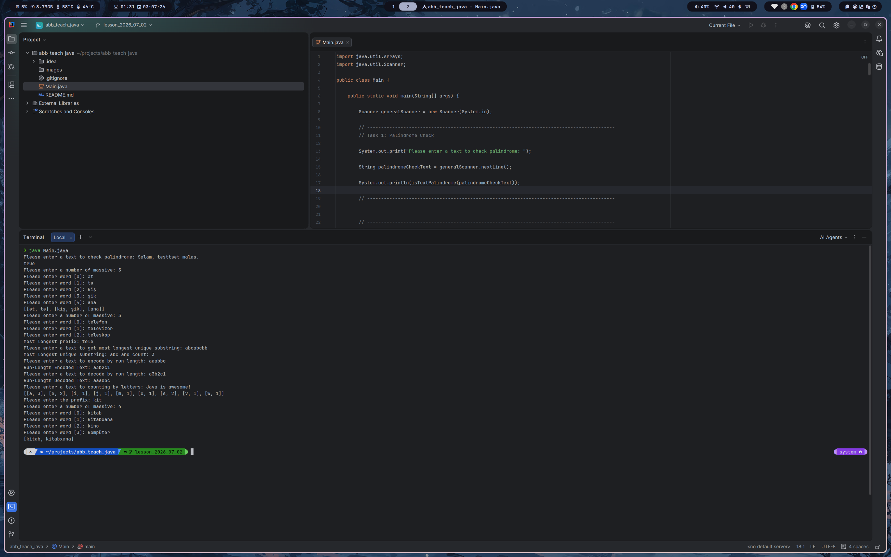

# Tapşırıq: File NIO Chat Server + Serialization

## Ssenari

Classic I/O modelində hər client üçün ayrıca thread lazımdır — 1000 client demək 1000 thread deməkdir. NIO Selector ilə isə bir thread minlərlə connection-u idarə edə bilir. Bu tapşırıqda siz məhz bu prinsipi tətbiq edən mini çat server yazacaqsınız — mesajlar isə serialize olunmuş obyektlər kimi ötürüləcək.

## Tələb olunan Arxitektura

### 1. ChatMessage sinfi (Serialization)

* Serializable implement etsin
* Sahələr: senderName, content, timestamp (long), və transient bir sessionToken sahəsi (həssas məlumat serialize olunmamalıdır)
* serialVersionUID mütləq təyin olunsun
* toString() metodu

### 2. ChatServer sinfi — NIO Selector əsasında

* ServerSocketChannel açılsın, configureBlocking(false) ilə non-blocking rejimə keçirilsin
* Selector yaradılsın, server OP_ACCEPT üçün register olunsun
* while(true) dövründə selector.select() çağırılsın
* SelectionKey üzərində iterasiya edərək:
  * key.isAcceptable() -> yeni client-i qəbul et, OP_READ üçün register et
  * key.isReadable() -> client-dən gələn byte-ları ByteBuffer-ə oxu, sonra ByteArrayInputStream vasitəsilə ObjectInputStream-ə çevirib ChatMessage obyektinə deserialize et
* Hər mesajı bütün digər qoşulmuş client-lərə broadcast et (yenidən serialize edərək, ByteBuffer-ə yazaraq)

### 3. ChatClient sinfi

* SocketChannel ilə serverə qoşulsun
* Scanner-dan mesaj oxusun, ChatMessage obyekti yaratsın (serialVersionUID, transient sahə daxil olmaqla)
* Obyekti serialize edib channel-a yazsın
* Ayrıca bir thread-də serverdən gələn mesajları oxuyub ekrana çıxarsın

### 4. Loglama — Classic I/O ilə (qarışıq tələb!)

* Hər qəbul edilən mesaj BufferedWriter ilə chat_log.txt faylına yazılsın (try-with-resources istifadə edərək)
* Server bağlananda bütün mesaj tarixçəsi (ArrayList<ChatMessage>) ObjectOutputStream ilə chat_history.dat faylına serialize edilsin
* Server yenidən açılanda menyu vasitəsilə istifadəçi seçsin:
  1. Yeni server başlat (boş tarixçə)
  2. Əvvəlki tarixçəni fayldan yüklə (deserialize et) və davam et

### 5. Təhlükəsizlik

* sessionToken niyə transient olmalıdır — kodda şərh (comment) şəklində izah edin
* ObjectInputStream-dən oxuyarkən yalnız ChatMessage sinfini qəbul edən sadə bir yoxlama/filter mexanizmi əlavə edin (ideal halda ObjectInputFilter istifadə edin) ki, "deserialization of untrusted data" riski minimuma enirilsin

## Əlavə Tələblər

* Buffer idarəetməsi (ByteBuffer.allocate(), flip(), clear() düzgün istifadə olunmalıdır)
* Çoxlu client (Minimum 3 client eyni vaxtda qoşula bilməlidir)
* Selector cleanup (Hər dövrədən sonra selectedKeys().iterator().remove() çağırılmalıdır)
* Exception handling (Client ayrılanda server crash olmamalıdır)
* Performance qeydi (Kod daxilində şərh: bu server nə üçün minlərlə client-i tək thread-də saxlaya bilir)

## Təhvil Strukturu

* ChatMessage.java (Model)
* ChatServer.java (Server)
* ChatClient.java (Client)
* chat_log.txt (Log faylı)
* chat_history.dat (Tarixçə faylı)

Qiymətləndirmə meyarlarında ən vacibi Selector-un düzgün konfiqurasiyası, serialization-ın düzgün işləməsi və fayl tarixçəsinin menyu vasitəsilə yüklənməsidir. Müəllimin Ruslan müəllim bu tapşırıqda NIO-nun gücünü başa düşdüyünü göstərməyini gözləyir. Uğurlar! :)

---

## Output image

### 1. Server başlayır (menyu)

