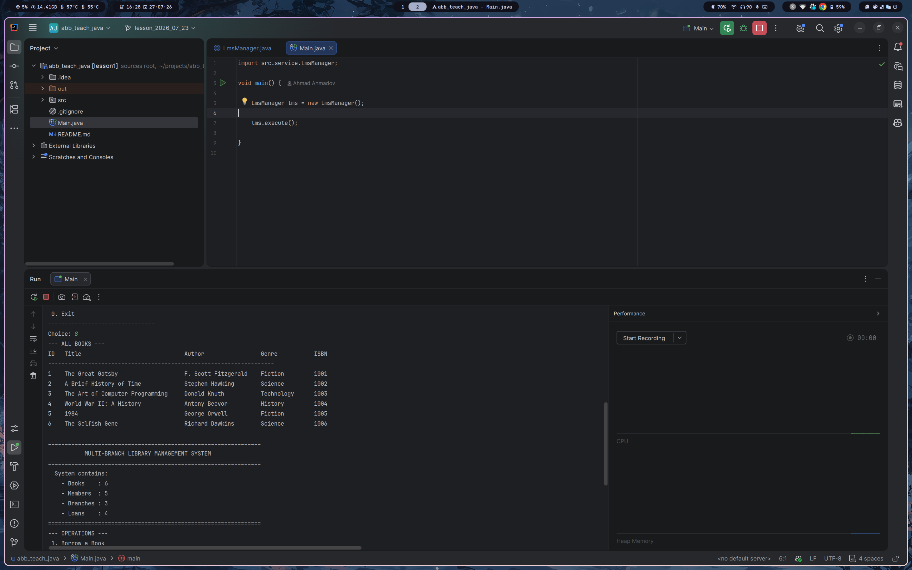

# Advanced Java 8+ Task — "Smart Library & Recommendations System"

Kitabxanada kitablar, istifadəçilər və onların kitab götürmə tarixçələri saxlanılır.
Sənin tapşırığın: kitabxana üçün "ağıllı analiz və tövsiyə sistemi" yazmaq.

## 1. Model siniflər

```java
import java.time.LocalDate;
import java.util.List;

class Book {
    private String title;
    private String author;
    private int year;
    private double rating; // 0.0 - 5.0
    private boolean isAvailable;

    // constructor, getters, setters, toString()
}

class BorrowRecord {
    private Book book;
    private LocalDate borrowedDate;
    private LocalDate returnedDate; // optional, if not returned -> null

    // constructor, getters, setters, toString()
}

class User {
    private String name;
    private int age;
    private List<BorrowRecord> borrowHistory;

    // constructor, getters, setters, toString()
}
```

## 2. Lambda və Comparator chaining

Kitabları sıralamaq:
- Əvvəlcə rating-ə görə azalan sırada,
- Əgər rating bərabərdirsə — year-ə görə artan sırada,
- Əgər o da bərabərdirsə — title-a görə alphabetically.

➡ bunu `Comparator.comparing(...).thenComparing(...).reversed()` ilə yaz.

## 3. Stream API — Dərin analizlər

Kitabxana səviyyəsində analizlər apar:

1. Bütün kitabların ortalama rating-ini tap.
2. 2000-ci ildən sonra yazılmış və hazırda mümkün (available) olan kitabların siyahısını çıxar.
3. Bütün istifadəçilərin borrowHistory-sindən ən çox götürülən kitabı tap (ən çox sayda borrowed olan).
   - ipucu: `flatMap` + `groupingBy(Book::getTitle, counting())`
4. Hər bir istifadəçinin hal-hazırda oxuduğu kitabları tap (yəni `returnedDate == null`).
   - nəticə `Map<String, List<Book>>` olsun (userName → kitab siyahısı).
5. Bütün kitabların müəlliflərinə görə qruplaşdır, amma yalnız 1950-dən sonra çıxan kitabları daxil et.
   - `Collectors.groupingBy(Book::getAuthor, filtering(...))` istifadə et.

## 4. Optional istifadə (Advanced chaining)

`LibraryService` adlı class yarat və içində aşağıdakı metodu yaz:

```java
Optional<Book> findRecommendedBookForUser(User user)
```

Qaydalar:
- Əgər user-in borrowHistory boşdursa → `Optional.empty()` qaytar.
- Əgər user varsa və kitablar götürübsə → o istifadəçinin ən çox oxuduğu müəllifdən ən yüksək rating-li kitabı tap və qaytar.
- Əgər həmin müəllifin yeni kitabı kitabxanada yoxdursa → `Optional.empty()`.
- Əgər varsa → `Optional.of(book)`.

`ifPresentOrElse()` ilə nəticəni çap et:

```java
libraryService.findRecommendedBookForUser(user)
    .ifPresentOrElse(
        b -> System.out.println("Recommended: " + b.getTitle()),
        () -> System.out.println("No recommendation available.")
    );
```

## 5. FlatMap və Collectors magic ✨

Bütün istifadəçilərin unikal müəlliflər siyahısını tap (yəni kim hansı müəllifin kitabını oxuyub).
Nəticə `Set<String>` olmalıdır.

İpucu:

```java
users.stream()
    .flatMap(u -> u.getBorrowHistory().stream())
    .map(r -> r.getBook().getAuthor())
    .collect(Collectors.toSet());
```

## 6. Bonus

"Top Reader of the Month" funksiyası yaz:

```java
Optional<User> findTopReaderOfMonth(List<User> users, int month, int year);
```

Şərtlər:
- İstifadəçinin həmin ayda neçə kitab götürdüyünü hesabla (filter ilə tarixə görə).
- Ən çox kitab götürən user-i tap (max və `Comparator.comparingLong(...)`).
- Əgər heç kim kitab götürməyibsə → `Optional.empty()`.

## Example

```java
public static void main(String[] args) {
    // --- Books ---
    Book b1 = new Book("1984", "George Orwell", 1949, 4.9, true);
    Book b2 = new Book("Animal Farm", "George Orwell", 1945, 4.8, false);
    Book b3 = new Book("Clean Code", "Robert Martin", 2008, 4.7, true);
    Book b4 = new Book("Effective Java", "Joshua Bloch", 2018, 4.9, true);
    Book b5 = new Book("The Pragmatic Programmer", "Andy Hunt", 1999, 4.6, true);
    Book b6 = new Book("Java Concurrency in Practice", "Brian Goetz", 2006, 4.5, false);

    List<Book> books = Arrays.asList(b1, b2, b3, b4, b5, b6);

    // --- Users ---
    User u1 = new User("Aydin", 25, Arrays.asList(
        new BorrowRecord(b1, LocalDate.of(2025, 9, 1), LocalDate.of(2025, 9, 10)),
        new BorrowRecord(b3, LocalDate.of(2025, 10, 5), null)
    ));
    User u2 = new User("Leyla", 22, Arrays.asList(
        new BorrowRecord(b4, LocalDate.of(2025, 10, 2), LocalDate.of(2025, 10, 20)),
        new BorrowRecord(b6, LocalDate.of(2025, 10, 12), null)
    ));
    User u3 = new User("Murad", 28, Arrays.asList(
        new BorrowRecord(b5, LocalDate.of(2025, 9, 10), LocalDate.of(2025, 9, 25))
    ));

    List<User> users = Arrays.asList(u1, u2, u3);

    // --- Library Service ---
    LibraryService service = new LibraryService(books, users);

    service.sortBooks();
    service.analyzeLibrary();
    service.uniqueAuthorsRead();

    System.out.println("\nRecommendation for Aydin:");
    service.findRecommendedBookForUser(u1)
        .ifPresentOrElse(
            b -> System.out.println("Recommended: " + b),
            () -> System.out.println("No recommendation available.")
        );

    System.out.println("\nTop Reader of October 2025:");

    service.findTopReaderOfMonth(10, 2025)
        .ifPresentOrElse(
            u -> System.out.println("Top Reader: " + u.getName()),
            () -> System.out.println("No reader found.")
        );

    // Bonus: calculate reading durations
    System.out.println("\nReading Durations:");
    users.stream()
        .flatMap(u -> u.getBorrowHistory().stream())
        .filter(BorrowRecord::isReturned)
        .forEach(r -> {
            long days = Duration.between(r.getBorrowedDate().atStartOfDay(),
                r.getReturnedDate().atStartOfDay()).toDays();
            System.out.println(r.getBook().getTitle() + " read in " + days + " days");
        });
}
```

## Result

```
Sorted Books:
 1984 (George Orwell, 1949) ⭐4.9
 Effective Java (Joshua Bloch, 2018) ⭐4.9
 Animal Farm (George Orwell, 1945) ⭐4.8
 Clean Code (Robert Martin, 2008) ⭐4.7
 The Pragmatic Programmer (Andy Hunt, 1999) ⭐4.6
 Java Concurrency in Practice (Brian Goetz, 2006) ⭐4.5

Library Analysis:
 Average Rating: 4.733333333333333
 Available after 2000: [Effective Java (Joshua Bloch, 2018) ⭐4.9, Clean Code (Robert Martin, 2008) ⭐4.7]
 Most borrowed book: Java Concurrency in Practice (1 times)
 Currently reading:
 Leyla -> [Java Concurrency in Practice (Brian Goetz, 2006) ⭐4.5]
 Aydin -> [Clean Code (Robert Martin, 2008) ⭐4.7]
 Murad -> []
 Books grouped by author (after 1950):
 Andy Hunt -> [The Pragmatic Programmer (Andy Hunt, 1999) ⭐4.6]
 Joshua Bloch -> [Effective Java (Joshua Bloch, 2018) ⭐4.9]
 Robert Martin -> [Clean Code (Robert Martin, 2008) ⭐4.7]
 Brian Goetz -> [Java Concurrency in Practice (Brian Goetz, 2006) ⭐4.5]

Authors read by users: [Andy Hunt, Joshua Bloch, Robert Martin, Brian Goetz, George Orwell]

Recommendation for Aydin:
Recommended: Clean Code (Robert Martin, 2008) ⭐4.7

Top Reader of October 2025:
Top Reader: Leyla

Reading Durations:
1984 read in 9 days
Effective Java read in 18 days
The Pragmatic Programmer read in 15 days
```

## Terminal Output

Example execution of the program:

