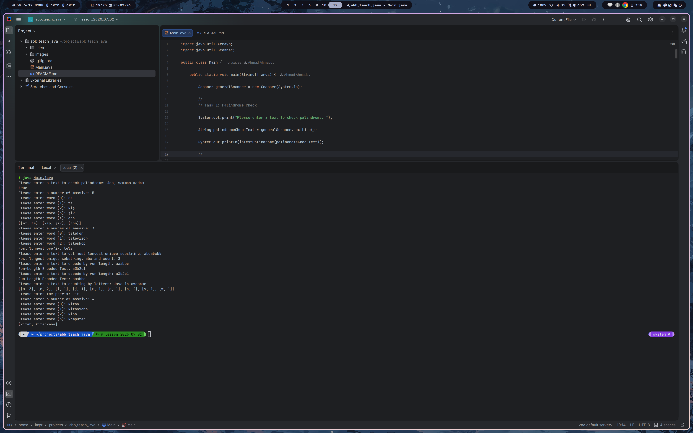

# Lesson Tasks — Stringlər & Data Strukturları

> **Qeyd:** Bütün həllər tək faylda — [`Main.java`](./Main.java) — yerləşir.

## How to run

```bash
java Main.java
```

## Console output

Proqramın işləyən nümunəsi (bütün tapşırıqların ardıcıl icrası):



---

## Tasks

### Tapşırıq 1: Palindrom Yoxlanışı

Verilmiş cümlənin palindrom olub-olmadığını yoxlayan funksiya yaz. Böyük/kiçik
hərf, boşluq və durğu işarələrinə fikir vermə.

```
"Ada, sammas madam"   →   true
"Salam dünya"         →   false
```

---

### Tapşırıq 2: Anagram Qrupları

Söz siyahısı verilib. Bir-birinin anagramı olan sözləri eyni qrupda topla.

```
["ət", "tə", "kiş", "şik", "ana"]
→ [["ət", "tə"], ["kiş", "şik"], ["ana"]]
```

---

### Tapşırıq 3: Ən Uzun Ümumi Prefiks

Sözlər massivində bütün sözlərin ortaq başlanğıc hissəsini (prefiksini) tap.

```
["telefon", "televizor", "teleskop"]   →   "tele"
["it", "pişik"]                        →   ""
```

---

### Tapşırıq 4: Təkrarsız Simvollu Ən Uzun Alt-sətir

Stringdə heç bir simvolun təkrarlanmadığı ən uzun ardıcıl hissəni tap.

```
"abcabcbb"   →   3   ("abc")
"bbbbb"      →   1   ("b")
```

---

### Tapşırıq 5: String Sıxılması (Run-Length Encoding)

Ardıcıl təkrarlanan simvolları sayı ilə əvəz edən sıxma funksiyası yaz. Sonra
əks əməliyyatı — açma (decode) funksiyasını da yaz.

```
encode("aaabbc")   →   "a3b2c1"
decode("a3b2c1")   →   "aaabbc"
```

---

### Tapşırıq 6: Hərflərin Say Cədvəli

Verilmiş cümlədə hər bir hərfin neçə dəfə təkrarlandığını tap. Boşluq və xüsusi
simvolları nəzərə alma. **Hər bir hərf nəzərə alınsın.**

```
String sentence = "Java is awesome";
```

Gözlənilən çıxış (sadəcə nümunə):

```
a - 3
e - 2
i - 1
j - 1
.....
```

---

### Tapşırıq 7: Trie ilə Avtomatik Tamamlama

Trie (prefiks ağacı) strukturu qur. Verilmiş prefiksə uyğun lüğətdəki bütün
sözləri tapan funksiya yaz.

```
words  = ["kitab", "kitabxana", "kino", "kompüter"]
prefix = "kit"
→ ["kitab", "kitabxana"]
```
